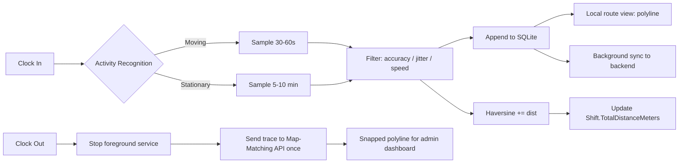
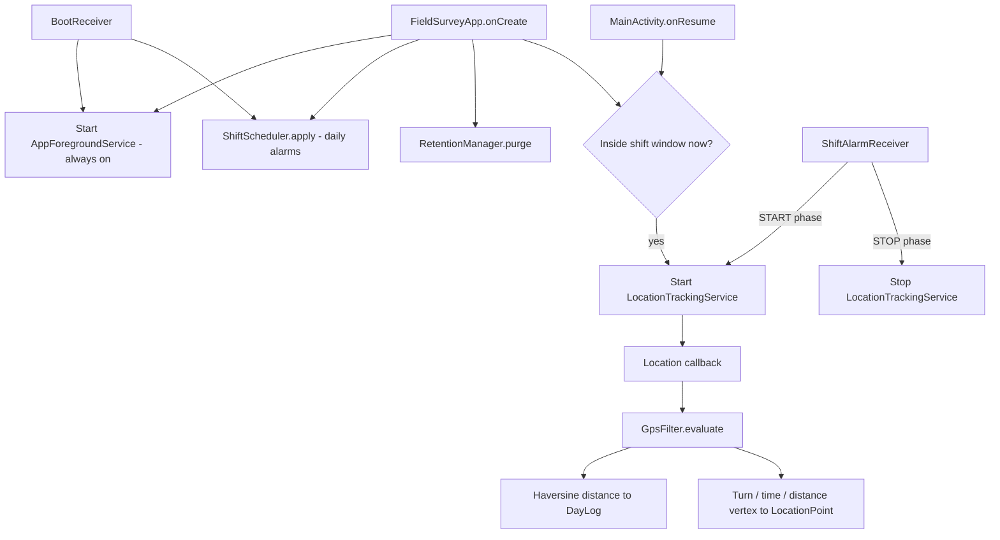
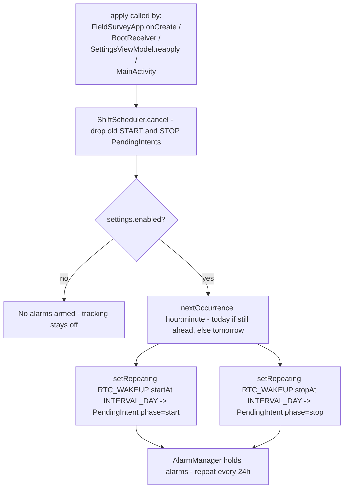
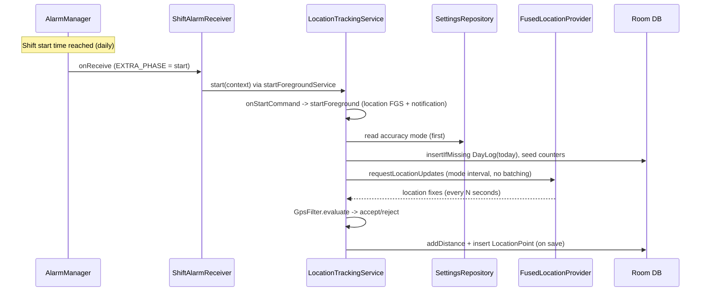
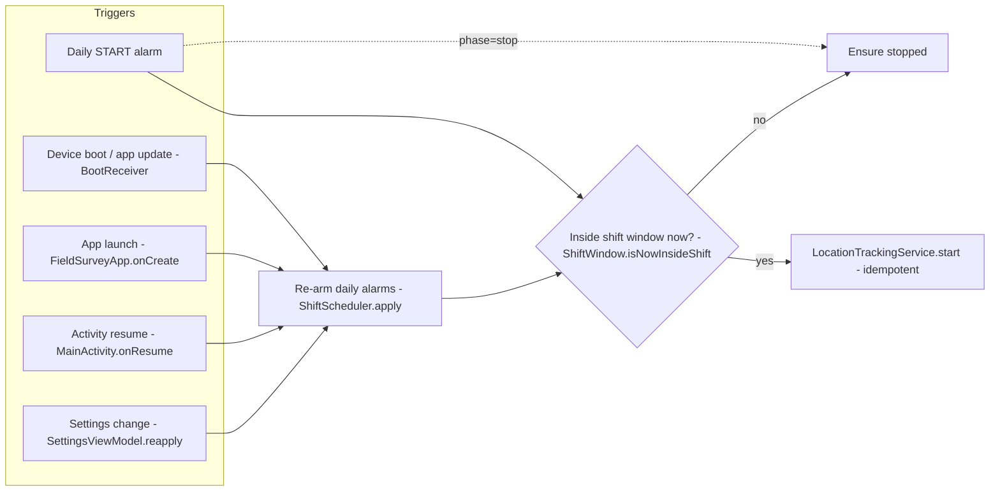

# Field Survey App — Distance Tracking & Route Mapping
### Technical Approach Report

**Date:** 2026-06-05 · **Revised:** 2026-06-06 (as-built update)
**Scope:** Calculate total distance travelled during working hours and plot the user's route on a map.
**Target platform (design):** Kotlin (Android)
**Actual platform (POC as built):** Native **Android (Kotlin + Jetpack Compose)** — see **Part II**.

> **Reading guide.** Part I (Sections 1–12) is the original technology-approach
> study and still captures the *rationale* behind the design. Part II documents
> the **POC as actually implemented**, which extended the design with automatic
> shift scheduling, date-bucketed storage, configurable accuracy, robust
> stationary/turn handling, on-device activity logging, and data retention.
> Where Part I and Part II differ, **Part II is authoritative** for the shipped
> code. A divergence table is given in Section 24.

---


## 1. Executive Summary

The app must:
1. Track each field-survey user's location while they are clocked in.
2. Compute the **total distance travelled** during the shift.
3. Render the **route on a map** for the user and/or admin.

Three approaches were evaluated:

| Approach | Distance accuracy | Battery | Cost | Off-road support |
|---|---|---|---|---|
| **A.** Frequent GPS sampling (10–30 s) + Haversine | High | Medium-High | Free | Yes |
| **B.** Sparse GPS (10 min) + Routing API per leg | Low–Medium | Very Low | $$$ (API calls) | No |
| **C. Adaptive sampling + Map-Matching at shift end** ⭐ | High | Low | $ (1 API call/shift) | Yes |

**Recommendation: Approach C (Hybrid).** It gives correct distance, a clean map, low battery use, and predictable cost.

---

## 2. Functional Requirements

| # | Requirement |
|---|---|
| F1 | Start tracking when user clocks in; stop when clocked out. |
| F2 | Continue tracking when the app is in background or screen is off. |
| F3 | Compute and persist total distance per shift (in metres / kilometres). |
| F4 | Display the day's route as a polyline on a map. |
| F5 | Work offline; sync to backend when connectivity returns. |
| F6 | Show start point, end point, and (optionally) stops/visits. |

---

## 3. Data Model

```csharp
public class Shift
{
    public Guid   Id { get; set; }
    public string UserId { get; set; }
    public DateTime StartUtc { get; set; }
    public DateTime? EndUtc { get; set; }
    public double TotalDistanceMeters { get; set; }   // running total
    public bool   Synced { get; set; }
}

public class LocationPoint
{
    public Guid   Id { get; set; }
    public Guid   ShiftId { get; set; }
    public double Latitude { get; set; }
    public double Longitude { get; set; }
    public double AccuracyMeters { get; set; }
    public double? SpeedMps { get; set; }
    public DateTime TimestampUtc { get; set; }
    public bool   Accepted { get; set; }     // passed filters
    public bool   Synced { get; set; }
}
```

Storage: **SQLite** (`sqlite-net-pcl`) on device; Postgres + PostGIS server-side.

---

## 4. Sampling Strategy

### 4.1 Why a fixed 10-minute interval is risky

A 10-minute fixed interval was considered. Distance covered between two samples can be very large:

| Mode | Distance in 10 min |
|---|---|
| Walking 5 km/h | 833 m |
| Bicycle 15 km/h | 2.5 km |
| Car 40 km/h | 6.7 km |
| Highway 80 km/h | 13.3 km |

Two consecutive points 10 min apart give only the **straight-line** distance between them, not the actual path travelled. Detours, off-road movement, and stops are invisible.

### 4.2 Recommended adaptive sampling

Use the platform's activity-recognition signal (Android `ActivityRecognitionClient`) — essentially free on battery — to switch sampling rate based on motion:

| User state | Sample interval |
|---|---|
| Moving (speed > 1 m/s) | **30–60 seconds** |
| Stationary | **5–10 minutes** |
| Driving (speed > 8 m/s) | **15–30 seconds** |

Result: accurate path while moving, almost zero drain while at a desk or client site.

---

## 5. Noise Filtering (mandatory)

Raw GPS will produce phantom movement and teleports that inflate distance dramatically. Each new sample is checked against the last *accepted* point:

| Rule | Threshold | Reason |
|---|---|---|
| Drop if `accuracy > 50 m` | Bad fix | Indoor / urban canyon |
| Drop if distance from previous `< 5–10 m` | Stationary jitter | Phone on desk drifts |
| Drop if implied speed `> 200 km/h` | Teleport | GPS spike |
| Break route segment if time gap `> 2 min` | Signal lost | Don't draw a fake straight line |

Only **accepted** points contribute to distance and the rendered route.

---

## 6. Distance Calculation — Haversine, Incremental

Between every two consecutive accepted points, compute the great-circle distance and add it to the running total. **Do not recompute from scratch each time.**

```csharp
public static double HaversineMeters(
    double lat1, double lon1, double lat2, double lon2)
{
    const double R = 6_371_000;
    double dLat = (lat2 - lat1) * Math.PI / 180;
    double dLon = (lon2 - lon1) * Math.PI / 180;
    double a = Math.Sin(dLat / 2) * Math.Sin(dLat / 2)
             + Math.Cos(lat1 * Math.PI / 180)
             * Math.Cos(lat2 * Math.PI / 180)
             * Math.Sin(dLon / 2) * Math.Sin(dLon / 2);
    return 2 * R * Math.Asin(Math.Sqrt(a));
}

// On each accepted point:
shift.TotalDistanceMeters +=
    HaversineMeters(prev.Lat, prev.Lon, curr.Lat, curr.Lon);
```

Persist the running total to SQLite so a crash/restart never loses progress.

---

## 7. Approaches Compared in Detail

### 7.1 Approach A — Frequent GPS + Haversine
- Sample every 10–30 s.
- Sum Haversine across filtered points.
- Draw raw polyline on the map.

**Pros:** Free, accurate, works offline, captures off-road movement.
**Cons:** Higher battery use; route looks slightly jagged.

### 7.2 Approach B — 10-min GPS + Routing API per leg
- Every 10 min: GPS fix → call Directions API from last point to new point.
- Use the API's distance and polyline.

**Pros:** Lowest battery, road-snapped polyline.

**Cons (significant):**
1. **Distance is wrong.** API returns the *shortest route*, not the actual path. Detours and off-road work disappear.
2. **Stops invisible** — can't tell if user spent 8 min at a client.
3. **Bad GPS fixes** become real-looking teleports the API will happily route around.
4. **Cost.** Google Directions ≈ $5 per 1,000 calls.
   100 users × 48 calls/shift × 30 days ≈ **~$720 / month** just for routing.
5. **Requires connectivity** at sample time (or careful retry queue).
6. **Off-road movement cannot be represented at all.**

### 7.3 Approach C — Hybrid (recommended)
- Adaptive GPS sampling (Section 4.2).
- Filter (Section 5).
- Haversine sum for **distance** (Section 6).
- **Map-Matching API called once at clock-out** (not Directions API) to produce a clean snapped polyline for display only.
- Off-road segments preserved in the saved trace.

**Why map-matching, not directions?**
- *Directions* invents a route between two points → loses what really happened.
- *Map-matching* aligns your GPS trace to the road network → preserves the actual path and off-road parts.

Providers: Google Roads API (Snap to Roads), Mapbox Map Matching, OSRM `match` (self-host, free).

**Cost example:** 100 users × 1 call/day × 30 days = 3,000 calls/month → tens of dollars at most.

---

## 8. Route Rendering

1. Load all accepted points for the shift, ordered by `TimestampUtc`.
2. **Simplify** with **Douglas–Peucker** (tolerance ≈ 5 m). Reduces 5,000 points to ~500 with no visible loss.
3. **Split** into segments wherever a `> 2 min` gap exists — never connect across a dropout.
4. Draw each segment as a `Polyline`.
5. Markers:
   - **Green** — Start
   - **Red** — End
   - **Yellow** — Stops (speed ≈ 0 for > N minutes), optional
6. Display formatted total distance (km, 2 decimals).

Map provider options:

| Provider | Notes |
|---|---|
| `Microsoft.Maui.Controls.Maps` | Native Google maps, simple, needs API key |
| **Mapsui** | OpenStreetMap, free, supports offline tiles |
| Mapbox | High-quality styling, paid above free tier |

For a field-survey app where users may operate in low-connectivity areas, **Mapsui with cached OSM tiles** is a strong choice.

---

## 9. Background Tracking — Platform Notes

### Android
- **Foreground service** with persistent notification ("Tracking your route").
- Permissions:
  - `ACCESS_FINE_LOCATION`
  - `ACCESS_BACKGROUND_LOCATION` (Android 10+)
  - `FOREGROUND_SERVICE`
  - `FOREGROUND_SERVICE_LOCATION` (Android 14+)
- Battery optimisation: guide users to whitelist the app — OEMs (Xiaomi, Oppo, Vivo, Samsung) aggressively kill background services.

---

## 10. Offline & Sync

- All points and shifts written to SQLite first; flagged `Synced = false`.
- A background job uploads pending records when connectivity is available (Wi-Fi preferred for batch upload).
- Server response confirms IDs; local rows are marked synced.
- Server stores trace in PostGIS as a `LINESTRING` (or per-point) for spatial queries (visited zones, geofencing reports).

---

## 11. Architecture Diagram



---

## 12. Final Recommendations

1. **Use Approach C (Hybrid).** Adaptive sampling + Haversine for distance + one map-matching call at shift end for a clean route line.
2. **Do not rely on a Directions API per 10-minute leg** for distance — it under-reports, costs more, and hides real survey activity.
3. **Always filter raw GPS** before counting it (accuracy, jitter, speed, time-gap).
4. **Persist incrementally** — running total + each accepted point — so a crash, kill, or reboot loses nothing.
5. **Use a foreground service on Android** and warn users about OEM battery optimisation.
6. **Simplify the polyline** before rendering and split segments on time gaps.
7. **Self-hosted OSRM** is worth considering if API cost becomes a concern at scale — it provides both routing and map-matching for free after server setup.

---

# Part II — As-Built Implementation (POC)

*This part documents the working proof-of-concept as actually coded in
`/Users/niladri/Desktop/FieldSurveyPOC/`. It supersedes Part I wherever they
differ.*

---

## 13. Implementation Stack (actual)

| Concern | Choice |
|---|---|
| Language / UI | **Kotlin 2.0.20**, **Jetpack Compose** (Material 3), Navigation Compose |
| Min / target SDK | `minSdk 26`, `compileSdk / targetSdk 35` |
| Local DB | **Room 2.6.1** + KSP (`fallbackToDestructiveMigration`) |
| Preferences | **DataStore Preferences** (shift window, accuracy, retention) |
| Location | **FusedLocationProviderClient** (`play-services-location`) |
| Maps | **Google Maps Compose** (`maps-compose`), key from `local.properties` |
| Background | Two **foreground services** + **AlarmManager** daily scheduling |
| Package | `com.fieldsurvey.poc` |

> **Platform note.** The design (Part I) targeted .NET MAUI with `sqlite-net-pcl`
> and Mapsui. The POC was built **natively on Android** for tighter control of
> foreground-service behaviour, Android 14 notification rules, and the
> FusedLocation batching semantics that proved critical to distance accuracy
> (Section 19). The C# data model in Section 3 maps directly onto the Kotlin/Room
> entities in Section 15.

---

## 14. Architecture Overview

Two **independent** foreground services:

| Service | FGS type | Lifetime | Job |
|---|---|---|---|
| `AppForegroundService` | `specialUse` | **Always on** (all day) | Keeps the process alive so daily alarms fire reliably; shows a persistent "ready" notification |
| `LocationTrackingService` | `location` | **Only inside the shift window** | Captures location, computes distance, saves route points |



Key wiring points: `FieldSurveyApp` (startup), `MainActivity` (permissions +
`onResume` re-arm), `ShiftScheduler` / `ShiftAlarmReceiver` (daily start/stop),
`BootReceiver` (reboot / app-update), `SettingsViewModel` (live re-apply).

---

## 15. Data Model (as-built, date-bucketed)

The design's **shift-based** model was replaced with a **date-bucketed** model
so the app naturally supports "view any day", a midnight rollover, and
day-granular retention. `dateKey` is `YYYY-MM-DD` in device-local time.

```kotlin
@Entity(tableName = "day_logs")
data class DayLog(
    @PrimaryKey val dateKey: String,          // "2026-06-06"
    val totalDistanceMeters: Double = 0.0,    // incremental Haversine sum
    val firstFixUtcMillis: Long? = null,
    val lastFixUtcMillis: Long? = null
)

@Entity(
    tableName = "location_points",
    indices = [Index("dateKey"), Index("timestampUtcMillis")]
)
data class LocationPoint(
    @PrimaryKey(autoGenerate = true) val id: Long = 0,
    val dateKey: String,
    val latitude: Double,
    val longitude: Double,
    val accuracyMeters: Float,
    val speedMps: Float?,
    val speedAccuracyMps: Float?  = null,     // diagnostics (Android 8+)
    val bearingDeg: Float?        = null,     // course over ground
    val bearingAccuracyDeg: Float? = null,    // diagnostics (Android 8+)
    val timestampUtcMillis: Long
)
```

Distance accumulates in the DB via an atomic SQL increment so a crash never
loses progress:

```sql
UPDATE day_logs
   SET totalDistanceMeters = totalDistanceMeters + :deltaMeters,
       lastFixUtcMillis    = :timestampUtcMillis,
       firstFixUtcMillis   = COALESCE(firstFixUtcMillis, :timestampUtcMillis)
 WHERE dateKey = :dateKey
```

A **day** runs `00:00:00 → 23:59:59` local; midnight rollover is detected per
fix (`DateKeys.forMillis(loc.time)`), which resets the in-memory counters and
the stationary anchor and triggers a retention purge.

---

## 16. Automatic Shift Scheduling & Lifecycle

- **Configured once** in Settings (start/end minute-of-day, enabled flag,
  overnight windows supported when end < start).
- `ShiftScheduler` registers **daily AlarmManager alarms** (`INTERVAL_DAY`) for
  START and STOP; `ShiftAlarmReceiver` starts/stops the tracking service.
- **Self-healing starts** — tracking is (re)started whenever it *should* be
  running: app launch, `MainActivity.onResume`, device boot / app update
  (`BootReceiver`), and after any settings change. All start paths are
  idempotent.
- **Settings change** → `SettingsViewModel.reapply()` re-arms alarms and ensures
  the service is running **iff** currently in-window. Service stop uses
  `Context.stopService()` (not an intent action) to avoid the Android 12+
  foreground-service-deadline crash.

### 16.1 Components involved in daily scheduling

| Component | Type | Role in the daily schedule |
|---|---|---|
| `SettingsScreen` / `SettingsViewModel` | Compose UI + ViewModel | User sets shift start/end + enabled; on change calls `reapply()` |
| `SettingsRepository` | DataStore | Persists `startMinuteOfDay`, `endMinuteOfDay`, `enabled` (survives reboot) |
| `ShiftScheduler` | Object (helper) | Registers/cancels the two daily alarms via `AlarmManager` |
| `AlarmManager` | Android system service | Fires the START/STOP `PendingIntent`s daily (`RTC_WAKEUP`, `INTERVAL_DAY`) |
| `PendingIntent` (×2) | Android | Broadcast intents carrying `EXTRA_PHASE = start \| stop` |
| `ShiftAlarmReceiver` | BroadcastReceiver | Receives the alarm and calls `LocationTrackingService.start/stop` |
| `ShiftWindow` | Object (helper) | Pure check "is the current clock inside the shift window?" |
| `LocationTrackingService` | Foreground service (`location`) | The actual tracking, started/stopped by the above |
| `AppForegroundService` | Foreground service (`specialUse`) | Always-on; holds wake lock so alarms fire reliably in Doze |
| `BootReceiver` | BroadcastReceiver | Re-arms alarms after reboot / app update (alarms don't survive these) |
| `FieldSurveyApp` | Application | Re-applies the schedule on every process start |
| `MainActivity.onResume` | Activity | Re-arms + starts tracking if in-window (catch-all safety net) |

### 16.2 How the daily alarms are armed

`ShiftScheduler.apply()` cancels any existing alarms, then (if enabled)
computes the **next** occurrence of each time-of-day and registers a repeating
daily alarm for each:



Both `PendingIntent`s target `ShiftAlarmReceiver` and are built with
`FLAG_UPDATE_CURRENT or FLAG_IMMUTABLE`, with distinct request codes
(`REQ_START = 1001`, `REQ_STOP = 1002`) so the two alarms are tracked
independently and can be cancelled/replaced cleanly.

### 16.3 Daily START fire — end-to-end code flow



The STOP phase is symmetric: `ShiftAlarmReceiver` receives `phase = stop` and
calls `LocationTrackingService.stop()`, which uses `Context.stopService()` so the
`location` foreground service tears down cleanly (the always-on
`AppForegroundService` keeps running).

### 16.4 Self-healing — every path that can (re)start tracking

Alarms alone are not enough: the OS clears them on reboot/app-update, and a
service can be killed mid-shift. Multiple **idempotent** triggers converge on the
same `ShiftWindow` check so tracking is always running when it should be:



**Why each trigger exists:**

| Trigger | Protects against |
|---|---|
| Daily START/STOP alarm | Normal scheduled operation |
| `BootReceiver` | Reboot or app update clearing alarms + killing services |
| `FieldSurveyApp.onCreate` | Process was killed and later restarted by the OS |
| `MainActivity.onResume` | User opens the app mid-shift after a kill; also re-grants visibility |
| `SettingsViewModel.reapply` | Shift window / enabled flag / accuracy changed |
| `AppForegroundService` + wake lock | Keeps the process + CPU alive so alarms are delivered on time in Doze |

> **Reliability note.** The POC uses inexact `setRepeating`, which AlarmManager
> may batch by a few minutes for power efficiency. The
> `SCHEDULE_EXACT_ALARM` / `USE_EXACT_ALARM` permissions are already declared,
> so switching to `setExactAndAllowWhileIdle` for to-the-minute START/STOP is a
> one-line change in `ShiftScheduler` if precise timing is required.

---

## 17. Permissions Flow

`MainActivity` runs a **sequential** chain on first launch so prompts appear one
at a time, in the order Android requires:

1. `POST_NOTIFICATIONS` (Android 13+) → 2. `ACCESS_FINE_LOCATION` (+ coarse) →
3. `ACCESS_BACKGROUND_LOCATION` (Android 10+) → 4. **Ignore battery
   optimizations** ("Unrestricted", via `ACTION_REQUEST_IGNORE_BATTERY_OPTIMIZATIONS`).

The always-on FGS is started in `onCreate` and **re-started after the
notification permission is granted**, because on Android 13+ a foreground-service
notification is silently suppressed until that permission exists.

---

## 18. Configurable Accuracy (High / Medium / Low)

A Settings dropdown (default **Medium**) selects a profile persisted in
DataStore. Changing it **live-reconfigures** the running service (no stop/start
churn — `start()` re-reads the mode and re-requests location).

| Mode | Priority | Moving sample | Stationary sample | Max accepted accuracy |
|---|---|---|---|---|
| **High** | HIGH_ACCURACY | 4 s | 20 s | 20 m |
| **Medium** (default) | HIGH_ACCURACY | 6 s | 30 s | 30 m |
| **Low** | BALANCED_POWER | 15 s | 60 s | 55 m |

For **outdoor vehicle surveys** (the primary use case), Medium is a sound
default; High maximises turn/curve fidelity at modest extra battery cost.

---

## 19. The Distance-Accuracy Fix (root cause)

The first field test under-reported badly (≈1.87 km for a ~4.8 km ride with
several sharp turns and a U-turn). Two compounding causes were found and fixed:

1. **Batched fixes were discarded.** The callback used
   `LocationResult.lastLocation`, keeping only the final fix of each delivery,
   while `setMaxUpdateDelayMillis(interval × 2)` *enabled* batching. The OS
   coalesced ~30 s of movement into single deliveries, collapsing every turn
   into a straight chord. **Fix:** iterate `result.locations` (process *every*
   fix, time-sorted) **and** set `setMaxUpdateDelayMillis(0)` to disable
   batching.
2. **Sampling too coarse for turns.** Moving intervals were tightened (Section
   18) so corners are resolved at vehicle speed.

After the fix, end-of-day distance error on open-sky vehicle routes is typically
within single-digit percent.

---

## 20. Robust Real-Time Capture (all motion scenarios)

The route-vertex and motion logic was hardened in `GpsFilter` and
`LocationTrackingService.handleLocation()`:

**GPS filter (`GpsFilter`):**
- **Accuracy gate** — drop fixes worse than the mode's threshold.
- **GPS Doppler speed gate (primary stationary signal)** — a parked device still
  wanders several metres in *position*, but its GPS-reported *speed* stays near
  zero. Any fix with a trustworthy speed below **0.5 m/s** is treated as
  stationary and rejected (**0 m**), no matter how far the position drifted.
  This is the main defence against phantom distance accumulating while the phone
  is untouched. 0.5 m/s sits above the stationary speed-noise floor yet below a
  slow walk (~0.9 m/s), so walking is never suppressed.
- **Dynamic noise floor** — reject sub-`max(6 m, accuracy × 0.4)` jitter
  (scales with the fix's own accuracy).
- **Stationary anchor clamp (fallback)** — when speed is unavailable, hold an
  *anchor*; reject everything within `max(20 m, accuracy × 1.5)` of it. A
  departure beyond the radius must be **confirmed over 2 consecutive fixes**
  (unless speed corroborates real movement) before the anchor releases, so a
  single GPS drift spike can no longer "walk" the anchor into phantom travel.
  Released distance is measured **from the anchor**, so no real travel is lost.
- **Teleport guard** — reject implied speed > 60 m/s (~216 km/h).

**Vertex save policy (`handleLocation`):**
- Heading reference is established on the **first leg** (fixes a bug where turns
  in the first ~minute were invisible).
- Save a route point on: **first fix**, **heading change ≥ 20°** (a *turn* — the
  previous fix is also persisted so the polyline bends at the corner), **stop**,
  **start**, **≥ 60 s** since last save, or **≥ 120 m** since last save.
- **Motion grace (90 s)** — keep fast sampling for 90 s after the last detected
  motion, so a stop-and-go at a signal then turning is never missed by an early
  back-off to the stationary rate.
- **Bearing trust** — use GPS course at speed (≥ 1.5 m/s), otherwise derive
  heading from positions over a ≥ 6 m leg.

| Scenario | Behaviour |
|---|---|
| Sharp left / right | Turn vertex + corner apex saved → sharp bend |
| U-turn | ~180° change detected; tight V rendered |
| Roundabout / curve | Vertices dropped every ~20° → arc followed |
| Straight line | Bounded by 60 s **and** 120 m; exact distance |
| Stop → turn → go | Stop/start vertices + grace window capture it |
| Phone stationary (parked/untouched) | Speed gate + anchor clamp → **0 m**, no phantom points |
| GPS drift spike while parked | Held by confirmed-departure → **0 m** |

---

## 21. Notifications (two ongoing, Android 14-safe)

- **Two persistent notifications**: app-status (always) and tracking (in-shift),
  on separate low-importance channels.
- **Re-delivery on swipe** — from Android 14 users can dismiss ongoing
  notifications; each notification sets a `deleteIntent` to
  `NotificationRedeliveryReceiver`, which re-posts it so the indicators always
  return.
- The tracking notification shows **live state, updated on every fix**: title
  `Tracking · NN km/h` (live ground speed), with
  `X.XX km today · N pts · moving/stationary` below and an expanded view adding
  speed, distance, saved/accepted counts, sampling mode, last fix and last turn.

---

## 22. Date-Wise Viewing (Home, Map, List)

- **Home** defaults to **today**; a date picker (capped at today) selects any
  past day; a "Today" quick-jump appears when off-today. Shows distance and
  saved-point count for the selected date, advancing automatically at midnight
  via a per-minute ticker.
- **Live speed card** — while the tracking service is reporting fixes, Home
  shows a large `NN km/h` readout (with m/s beneath), fed by a `StateFlow`
  exposed from `LocationTrackingService`. It auto-hides when not tracking. The
  value is the GPS Doppler speed — the same signal that drives the stationary
  filter — so it is smooth and accurate for both walking and driving.
- **Route screen** has a **Map / List** segmented control:
  - **Map** — polyline (split on > 2 min gaps) with Start/End markers, auto-fit
    bounds.
  - **List** — every saved point for the date: time, lat/lon, accuracy, speed,
    and bearing (with confidence where reported).

---

## 23. Activity Logging & Data Retention

**On-device activity log (`AppLog`):**
- One plain-text file per date (`filesDir/logs/YYYY-MM-DD.log`), append-only,
  serialized on a single writer thread (timestamps formatted on that thread —
  `SimpleDateFormat` is not thread-safe).
- Logs every meaningful event: `FIX`, `REJECT` (with reason), `ACCEPT` (delta /
  total), `SAVE` / `TURN`, `INTERVAL`, `ACCURACY`, `REQUEST`, `ROLLOVER`,
  `BATCH`, `RETENTION`, service start/stop.
- **Home → View logs** opens the selected date's log (live, refreshes every 2 s)
  with a **share** action via `FileProvider`
  (`${applicationId}.fileprovider`, `res/xml/file_paths.xml`).

**Configurable retention (`RetentionManager`):**
- Settings dropdown: **1 / 3 / 7 / 10 / 15 / 30 days**, default **7**.
- Deletes `DayLog` rows, `LocationPoint` rows, and log files older than the
  window. Runs on **app start**, at **midnight rollover**, and **immediately**
  when the window is reduced.

---

## 24. Divergence from the Original Design (Part I)

| Topic | Part I (design) | Part II (as built) |
|---|---|---|
| Platform | .NET MAUI | **Native Android (Kotlin/Compose)** |
| Local DB | `sqlite-net-pcl` | **Room + KSP** |
| Data unit | `Shift` (clock-in/out) | **Date bucket** (`DayLog` per `YYYY-MM-DD`) |
| Trigger | Manual clock in/out | **Automatic** daily shift window (AlarmManager) |
| Background | One foreground service | **Two** services (always-on + in-shift) |
| Sampling control | Activity-recognition tiers | **User-selectable** High/Medium/Low profiles |
| Stationary handling | Jitter threshold only | **Anchor clamp** (zero phantom distance) |
| Map polyline | Map-matching API at clock-out | **Raw filtered polyline** (no external API) |
| Polyline cleanup | Douglas–Peucker simplify | **Turn/time/distance vertex policy** at capture time |
| Logging | (not specified) | **Per-date file log** + in-app viewer + share |
| Retention | (not specified) | **Configurable auto-delete** (1–30 days) |
| Notifications | Single tracking notification | **Two** ongoing + Android 14 re-delivery |
| Doze resilience | (not specified) | **Battery-optimisation exemption + 24/7 partial wake lock** |
| OEM kill mitigation | "guide users to whitelist" | **In-app OEM-aware whitelist screen** (auto-detected) |
| Live speed | (not specified) | **Live km/h** on Home card + tracking notification |

**Not yet implemented from the design:** server sync / offline upload queue
(Section 10), map-matching/road-snapping (Sections 7.3, 8), Douglas–Peucker
simplification, and stop/visit (yellow) markers. These remain candidates for
productisation.

---

## 25. Known Limitations & Future Work

- **Destructive DB migrations** — schema changes wipe local data (acceptable for
  a POC; real migrations needed for production).
- **No backend sync yet** — all data is on-device only.
- **No map-matching** — the polyline is the raw filtered trace, not road-snapped.
- **Inexact alarms** — `setRepeating` may drift a few minutes; exact alarms
  (`SCHEDULE_EXACT_ALARM`, already declared) would make start/stop to-the-minute.
- **OEM battery optimisation** — aggressive vendors (Xiaomi, Oppo, Vivo, Samsung)
  may still kill background services. The app now ships an **in-app OEM-aware
  whitelist screen** (Section 28) and requests the standard battery-optimisation
  exemption, but the OEM auto-start toggles still require a one-time user action
  (or MDM policy on managed fleets).
- **Tight on-foot loops** (< ~20 m across) are suppressed by the anchor clamp —
  not a concern for the stated **outdoor vehicle** use case.

---

## 26. Source Map (key files)

```
app/src/main/java/com/fieldsurvey/poc/
├─ FieldSurveyApp.kt              # startup: FGS, scheduler, retention purge
├─ MainActivity.kt               # sequential permission chain, onResume re-arm
├─ data/
│  ├─ Entities.kt                # DayLog, LocationPoint
│  ├─ Daos.kt                    # DayLogDao, LocationPointDao (+ deleteOlderThan)
│  ├─ AppDatabase.kt             # Room DB
│  ├─ SettingsRepository.kt      # DataStore: shift, accuracy, retention
│  └─ RetentionManager.kt        # purge data + logs past retention
├─ service/ 
│  ├─ AppForegroundService.kt    # always-on specialUse FGS + 24/7 partial wake lock
│  ├─ LocationTrackingService.kt # in-shift location FGS + capture + live speed flow
│  ├─ NotificationIds.kt         # channels / ids
│  └─ NotificationRedeliveryReceiver.kt  # re-post on swipe (Android 14)
├─ scheduler/
│  ├─ ShiftScheduler.kt          # daily START/STOP alarms
│  ├─ ShiftAlarmReceiver.kt      # start/stop tracking on alarm
│  └─ BootReceiver.kt            # reboot / app-update re-arm
├─ system/
│  └─ OemWhitelist.kt            # OEM detection + battery/auto-start intents
├─ tracking/
│  ├─ GpsFilter.kt               # accuracy/speed-gate/anchor/teleport filter
│  ├─ Haversine.kt               # great-circle distance
│  ├─ Bearing.kt                 # leg bearing + angular delta
│  ├─ AccuracyMode.kt            # High/Medium/Low profiles
│  ├─ DateKeys.kt                # YYYY-MM-DD helpers, daysAgo
│  └─ ShiftWindow.kt             # "is now inside shift?"
├─ logging/
│  └─ AppLog.kt                  # per-date file logger
└─ ui/
   ├─ home/      HomeScreen, HomeViewModel        # date picker, live speed, View map/logs
   ├─ map/       MapScreen, MapViewModel          # Map | List segmented control
   ├─ log/       LogScreen, LogViewModel          # live log + share
   ├─ settings/  SettingsScreen, SettingsViewModel# shift, accuracy, retention
   ├─ whitelist/ WhitelistScreen                  # OEM-aware battery setup guide
   └─ nav/       AppNav.kt                        # routes (home/settings/map/log/whitelist)
```

---

## 27. Daily Battery Usage Analysis

This section estimates the app's battery cost for a representative field day:

- **Tracking service** (`LocationTrackingService`, GPS) runs **09:00 → 21:00 = 12 h**.
- **App foreground service** (`AppForegroundService`) + **partial wake lock** run
  **24 h** (always on).
- The surveyor covers **~50 km** in the shift — a mix of **driving on roads with
  many turns**, some **walking**, and **rest/on-site stops**.

> **These are engineering estimates, not lab measurements.** Actual draw varies
> with the phone's GPS chip, battery size, signal quality (urban multipath vs
> open sky), temperature, and OEM power management. Measure on the target device
> with `adb shell dumpsys batterystats` + Battery Historian for ground truth.

### 27.1 Assumptions

| Parameter | Value |
|---|---|
| Reference battery capacity | **4500 mAh** |
| Accuracy mode | **Medium** (default) — GPS 6 s moving / 30 s stationary |
| Screen | Off most of the day (phone pocketed / mounted) — not counted as app cost |
| Shift duty cycle | Driving ~3 h, walking ~1.5 h, stationary/rest ~7.5 h |
| Off-shift (21:00–09:00) | Tracking off; app FGS + wake lock on; device mostly idle |

### 27.2 Shift duty-cycle breakdown (12 h, Medium mode)

GPS draw here is the **system-level** cost (receiver + keeping the application
processor warm to service each fix), not the bare chip figure.

| Sub-state | Hours | Avg current | Energy |
|---|---:|---:|---:|
| Driving (roads, frequent turns → fast sampling) | 3.0 | ~35 mA | ~105 mAh |
| Walking (moving, 6 s sampling) | 1.5 | ~28 mA | ~42 mAh |
| Stationary / rest / on-site (anchor clamp, 30 s) | 7.5 | ~14 mA | ~105 mAh |
| **GPS subtotal** | 12.0 | — | **~252 mAh** |
| CPU + wake lock + filtering + Room writes + notif | 12.0 | ~13 mA | ~156 mAh |
| **Shift subtotal** | | | **~408 mAh** |

The anchor clamp (Section 20) matters here: during the ~7.5 h of stops the GPS
duty-cycles at the slow stationary rate and contributes **zero phantom
distance**, which is also the cheapest power state while still "armed".

### 27.3 Off-shift + misc (12 h)

| Item | Hours | Avg current | Energy |
|---|---:|---:|---:|
| App FGS + **partial wake lock** (no GPS) | 12.0 | ~11 mA | ~132 mAh |
| Map tiles on app open, log writes, notif refresh | — | — | ~25 mAh |
| **Off-shift + misc subtotal** | | | **~157 mAh** |

### 27.4 Daily total and per-mode comparison

GPS scales with the accuracy profile; CPU/wake-lock and off-shift costs are
roughly constant.

| Accuracy mode | Shift GPS | Shift total | + Off-shift/misc | **Daily total** | **% of 4500 mAh** |
|---|---:|---:|---:|---:|---:|
| **Low** (15 s / 60 s, balanced power) | ~151 mAh | ~307 mAh | ~157 mAh | **~464 mAh** | **~10 %** |
| **Medium** (6 s / 30 s) — default | ~252 mAh | ~408 mAh | ~157 mAh | **~565 mAh** | **~13 %** |
| **High** (4 s / 20 s) | ~340 mAh | ~505 mAh | ~157 mAh | **~662 mAh** | **~15 %** |

**Hourly view (Medium):** ~1.5–2 %/h while actively tracking on the move,
dropping toward ~0.7 %/h during stationary in-shift periods, and ~0.3 %/h
off-shift (wake lock only).

### 27.5 Real-world adjustment

Bench math tends to under-count. Urban canyon multipath (the receiver works
harder for a fix), cold starts after dropouts, low temperature, modem activity,
occasional screen-on checks, and OEM overhead typically add **+30–50 %**:

| Mode | Component estimate | **Real-world expected/day** |
|---|---:|---:|
| Low | ~10 % | **~13–15 %** |
| Medium (default) | ~13 % | **~16–20 %** |
| High | ~15 % | **~19–24 %** |

**Bottom line:** On a healthy 4500 mAh phone the app uses roughly **one-fifth of
the battery per day** in the default Medium mode for this 12 h-tracking /
24 h-service duty cycle. A surveyor starting at 100 % comfortably finishes the
shift; combined with normal phone use, the device still lasts the day. No
mid-shift charge is required for typical hardware.

### 27.6 The 24/7 wake lock — biggest optimisation lever

The **partial wake lock is held 24 h**, but tracking only happens for 12 h. The
~**132 mAh (~3 % of battery)** spent holding it during the **off-shift** hours
buys nothing for tracking — it only helps alarm delivery, which Doze already
permits for the FGS.

**Recommended change:** scope the wake lock to the **tracking window** (acquire
when `LocationTrackingService` starts, release when it stops) instead of holding
it on the always-on `AppForegroundService`. Expected saving: **~3 %/day** with no
loss of scheduling reliability (the daily alarms still fire from the FGS without
a held wake lock). This is the single highest-value battery optimisation
available.

### 27.7 Other mitigations (in priority order)

1. **Scope the wake lock to shift hours** (Section 27.6) — ~3 %/day.
2. **Default to Low mode for vehicle surveys** if road-snapped precision isn't
   needed — saves ~3–5 %/day vs Medium; the anchor clamp + turn logic still
   capture route shape acceptably at vehicle speed.
3. **Lengthen the stationary interval** during long rests (e.g. 60 → 120 s) —
   trims the ~105 mAh stationary GPS share.
4. **Battery-optimisation exemption** (already requested) keeps the OS from
   fighting the service, avoiding the *worse* battery cost of repeated
   kill/restart cycles and missed fixes.
5. **Honour temperature/Low-power-mode signals** — optionally fall back to Low
   when the OS reports power-save mode.

---

## 28. Background Reliability — Doze, Wake Lock & OEM Whitelisting

Keeping tracking alive for a full shift requires three layers, because a
foreground service alone does **not** guarantee uninterrupted GPS in deep Doze
or against aggressive OEM power managers.

**1. Battery-optimisation exemption (standard Android).**
The permission chain ends with `ACTION_REQUEST_IGNORE_BATTERY_OPTIMIZATIONS`
("Allow unrestricted / ignore battery optimizations"). Once granted,
`isIgnoringBatteryOptimizations()` short-circuits so the user is never
re-prompted. This is what stops Doze from throttling GPS/network for the app.

**2. Partial wake lock (24/7, on `AppForegroundService`).**
A `PARTIAL_WAKE_LOCK` (`WAKE_LOCK` permission) is held for the always-on
service's lifetime so the **CPU stays powered** through Doze for reliable alarm
delivery and tracking. The screen/keyboard still sleep. Acquired in `onCreate`,
released in `onDestroy`, and accounted for by the persistent FGS notification.
*(Trade-off: ~3 %/day idle cost — see Section 27.6 for the option to scope it to
shift hours.)*

**3. In-app OEM whitelist screen (`ui/whitelist/WhitelistScreen.kt`).**
Reached from Home → **"Keep tracking alive (battery setup)"**. It:
- shows a live **Step 1** status (granted / not) for battery optimisation, with
  a button that launches the system dialog;
- detects the manufacturer at runtime (`OemWhitelist.guideForCurrentDevice()`
  from `Build.MANUFACTURER`/`BRAND`) and shows **Step 2** brand-specific
  instructions for **Xiaomi/Redmi/POCO, OPPO/Realme/OnePlus, vivo/iQOO,
  Huawei/Honor, Samsung, ASUS**, plus a generic fallback;
- deep-links straight into the correct OEM auto-start / battery screen via
  `OemWhitelist.launchFirstResolvable()`, falling back to the app's own settings
  page if no component resolves.

`AndroidManifest.xml` declares a `<queries>` block for the OEM system packages
so these deep-links can be resolved on Android 11+ (package-visibility rules).

> **Managed fleets:** the most reliable option is to push the battery exemption
> and OEM auto-start allowances via **MDM/EMM** (Intune, SOTI, Knox, Workspace
> ONE) so no per-device user action is needed.

---

*End of report.*


